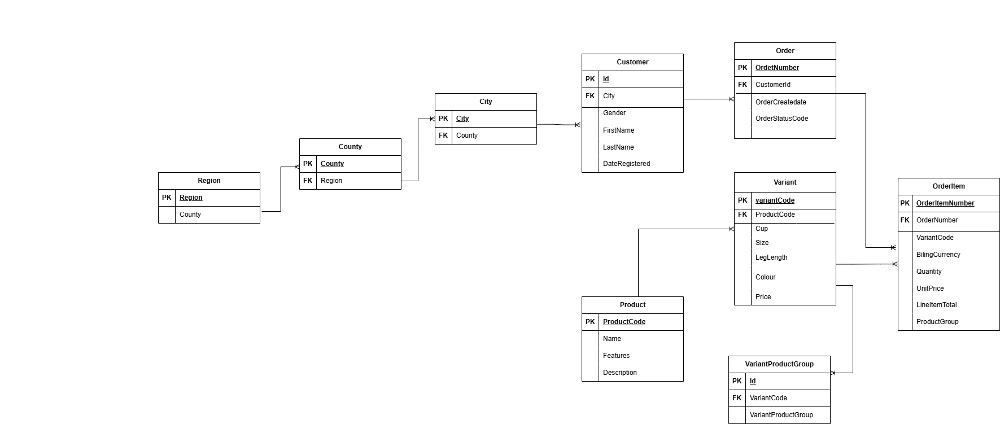
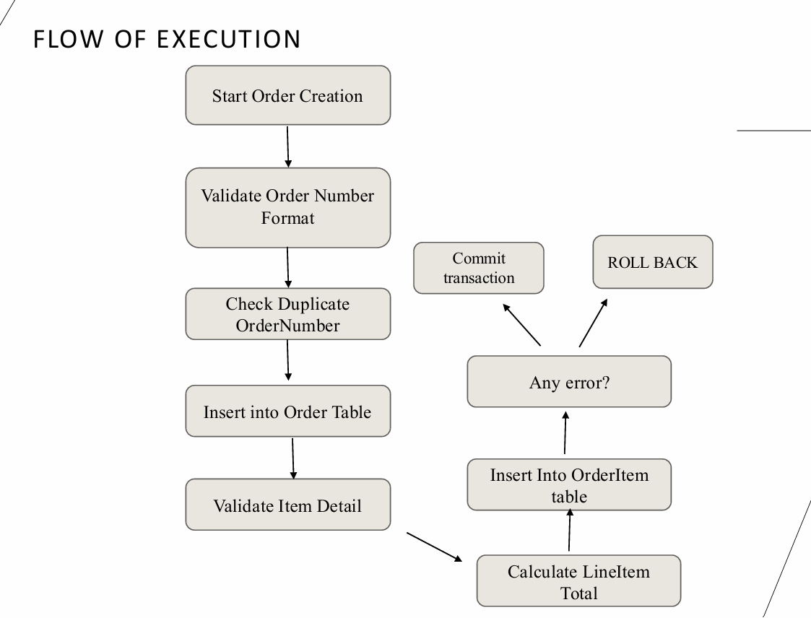
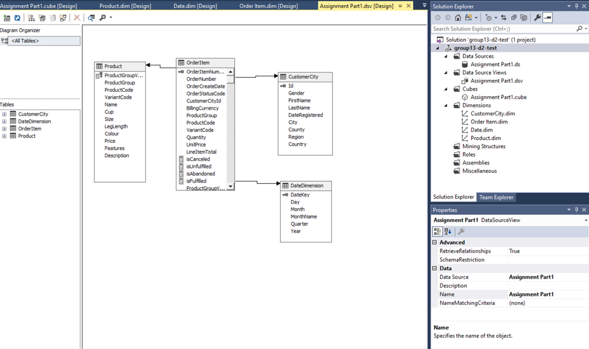
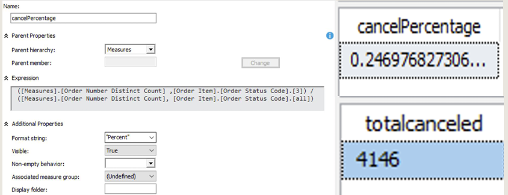
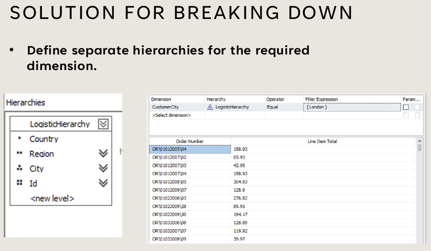

# Retail Orders – End-to-End Data Engineering & BI Project

This project demonstrates a **complete workflow** for database design, normalization, transaction handling, and business intelligence reporting using SQL Server and SSAS (SQL Server Analysis Services).  

The work was completed as part of an academic project and showcases **best practices** in data modeling, error handling, and BI cube design.  

---

## Project Overview

- **Problem** → Original dataset was denormalized with redundant attributes and partial dependencies.  
- **Solution** → Normalize tables (1NF → 3NF), implement robust transaction handling, and build BI dashboards.  
- **Outcome** → 9 normalized tables, automated stored procedure logic, and SSAS cube powering BI dashboards with KPIs and hierarchies.  

---

## 1. Database Normalization

### Original Tables
- **CustomerCity**  
- **Product**  
- **OrderItem**

### Normalization Steps
- **1NF** → Ensured atomic values and unique keys.  
- **2NF** → Removed partial dependencies by splitting Product into `Variant` and `VariantProductGroup`.  
- **3NF** → Eliminated transitive dependencies, added surrogate keys where necessary.  

### Final Schema
- 9 fully normalized tables  
- ER diagram showing relationships between **Customer, Product, Variant, Order, OrderItem**  

ERD:  

---

## 2. Transaction Management & Error Handling

### Concepts Applied
- **BEGIN / COMMIT / ROLLBACK** – atomic transactions  
- **TRY / CATCH** – error handling  
- **THROW** – custom error messages  

### Stored Procedure Design
- `prCreateOrderGroup` → Creates an order  
- `prCreateOrderItem` → Adds items to order  

### Example Scenarios
- Duplicate `OrderNumber` → transaction rolled back  
- Missing `VariantCode` → transaction rolled back with error  

📊 Transaction Flow:  

**Impact** → Prevented data inconsistencies and ensured reliable database operations.  

---

## 3. Business Intelligence (BI)

The normalized schema was integrated into **SSAS** to build a cube for analytics.

### BI Components
- **Cube (.cube)** – measures, hierarchies, KPIs  
- **Dimensions (.dim)** – CustomerCity, Product, Date, OrderItem  
- **Data Source View (.dsv)** – logical schema of tables  
- **Partitions** – improved cube processing  

Cube Design:  

---

### Measures
1. **Order Number Distinct Count** – number of unique orders  
2. **Cancel Percentage** – ratio of cancelled orders (`StatusCode=3`) to total orders  

Cancel Percentage Example:  

---

### Hierarchies
- **LogisticHierarchy** → Country → Region → City → Customer  

📊 Screenshot:  

---

### Dashboards
Built BI dashboards (Power BI / SSAS cube browser) to visualize:  
- Sales trends over time  
- Cancel vs fulfilled %  
- Regional drilldowns (Country → Region → City → Customer)  

**Impact** → Enabled decision-making at both macro (country/region) and micro (customer) levels.  

---

## 4. Project Files

- **Normalization/** → Documentation of 1NF → 3NF + ERD  
- **BI/** → Cube definitions, dimension files, and BI screenshots  
- **Project/** → Visual Studio solution + SSAS project files (for reproducibility)  

---

##  Key Outcomes

- Transformed denormalized tables into a **robust 3NF schema**.  
- Implemented **transaction-safe procedures** with rollback/error handling.  
- Designed an **SSAS cube** with measures and hierarchies.  
- Delivered BI dashboards for **business insights and drilldowns**.  

---

## Why This Matters

- **Data Integrity** → Normalization + transaction handling ensures clean, consistent data.  
- **Scalability** → Schema is suitable for BI and advanced analytics.  
- **Industry Relevance** → Demonstrates skills in **SQL, database design, and BI tools** (SSAS, Power BI).  

---

## 👤 Author

**Shivasmi Sharma**  
MSc Data Science – University of Surrey  

🔗 GitHub: [github.com/shivasmi07](https://github.com/shivasmi07)  
🔗 LinkedIn: [linkedin.com/in/shivasmi-sharma](https://www.linkedin.com/in/shivasmi-sharma)  
